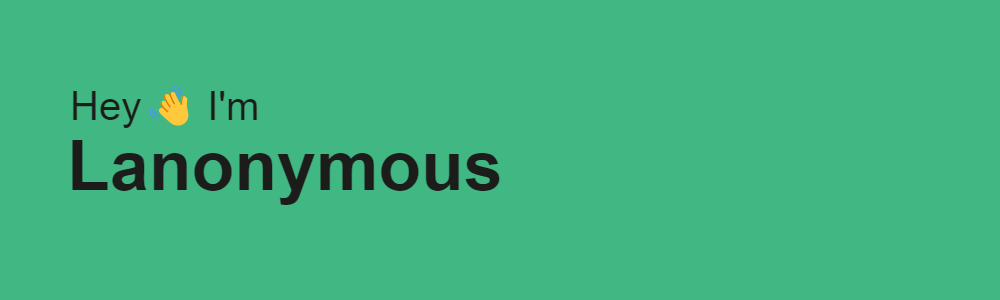

    

 
<h1 align="center">😎 About Me</h1>

   **🔨 I’m currently working on : Clockwork Odyssey (Mc 1.19.2 Modpack)**

   **🌱 I’m currently learning : Javascript, VueJS**

   **📌 I'm the Owner of Oméga Studios**

   **✉️ Feel free to DM me or contact me if needed**

 
<h1 align="center">🚀 Skills</h1>

  
  
  
  
  
  
  
  

 
<h1 align="center">💻 IDE I Use</h1>
 

  
  
  
  

 
<h1 align="center">🫂 Social</h1>
 

  
  
  

  
  

 
<h1 align="center">⚡️ Stats</h1>
 

<h3 align="center">🪄 My Streak</h3>

<h3 align="center">⭐️ My Stats</h3>

<h3 align="center">💡 Most Used Languages</h3>

<h3 align="center">📈 Contribution Graph</h3>

<h3 align="center">🤪 Joke</h3>

<h3 align="center">🌐 Discord</h3>

 

